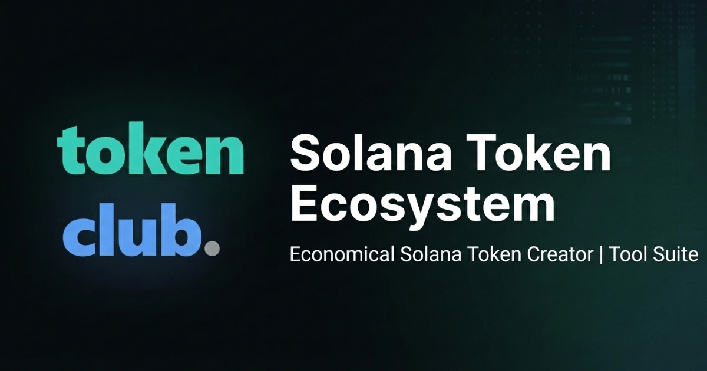

# 🚀 TokenClub Ecosystem
**The Economical "All-in-One" Solana Token Suite for Developers & Creators**

  <a href="#-the-ecosystem">The Ecosystem</a> •
  <a href="#-features--tools">Features</a> •
  <a href="#-price-comparison">Price Comparison</a> •
  <a href="#-volume-bot-engine">Volume Bot</a> •
  <a href="#-roadmap">Roadmap</a>

---

## ⚡ The "David vs. Goliath" of Solana Tools

Stop overpaying for basic tools. **TokenClub** is the "David" to the industry "Goliaths" (like Smithii or Orion). We provide the **exact same infrastructure** for token creation, liquidity management, and volume generation—but at **1/5th of the cost**.

We believe launching a meme coin or utility token shouldn't cost you 5 SOL.

## 🌐 The Ecosystem

We operate three distinct platforms tailored for every stage of your token's lifecycle:

| Platform | URL | Purpose |
| :--- | :--- | :--- |
| **TokenClub** | [**tokenclub.fun**](https://tokenclub.fun) | **Create & Manage:** Launch tokens, create OpenBook Market IDs, Burn Liquidity, and Revoke Authority. |
| **Volume Engine** | [**bot.tokenclub.fun**](https://bot.tokenclub.fun) | **Boost Metrics:** Automated Volume Bot to generate trending stats on Raydium & DexScreener. |
| **CoinFace** | [**coinface.fun**](https://coinface.fun) | **Promote:** The "Face" of your coin. A dedicated promotion platform to get eyes on your project. |

---

## 🛠 Features & Tools

### 1. 🪙 Token Creator (SPL Standard)
Launch your token in seconds without writing a single line of Rust code.
- **Cost:** `0.1 SOL` (Industry average: 0.5 SOL)
- **Features:** Custom Name, Symbol, Decimals, Supply, Image, and Description.
- **Security:** No mint authority option available (Safe Launch).

### 2. 📊 OpenBook Market ID Creator
The most expensive step in launching on Solana is creating the Market ID. We optimized the protocol to make it cheaper.
- **Optimized Storage:** Rent retrieval enabled.
- **Speed:** Instant market ID generation for Raydium liquidity pools.

### 3. 🔥 Liquidity Manager
- **Burn Liquidity:** Permanently burn LP tokens to prove safety to your investors ("Burnt & Renounced").
- **Revoke Mint Authority:** Make your token "un-mintable" to achieve 100% safety score on scanners like RugCheck.xyz.

---

## 🤖 Volume Bot Engine

The **[TokenClub Volume Bot](https://bot.tokenclub.fun)** is a non-custodial engine designed to simulate organic trading activity.

> **Warning:** This tool is for educational and testing purposes.

### Key Capabilities:
* **Maker Mode:** Creates continuous buy/sell orders to maintain the chart "green."
* **Micro-Wallets:** Generates fresh wallets for every transaction to avoid "bot detection" on DexScreener.
* **Jito Bundles:** Uses Jito-Solana bundles to ensure transactions land 100% of the time, even during network congestion.

### How to use:
1.  Connect Wallet at `bot.tokenclub.fun`.
2.  Input your Token Mint Address (CA).
3.  Load your "Worker Wallet" with SOL.
4.  Set **Min/Max Buy Amount** (e.g., 0.01 - 0.05 SOL).
5.  Click **Start Engine**.

---

## 💰 Price Comparison (Why switch?)

| Feature | Smithii.io | Orion Tools | TokenClub.fun 🏆 |
| :--- | :--- | :--- | :--- |
| **Token Creation** | ~0.5 SOL | ~0.5 SOL | **0.1 SOL** |
| **Market ID** | ~3.0 SOL | ~2.8 SOL | **0.15 SOL** |
| **Revoke Authority**| Paid | Paid | **Included/Cheaper** |
| **Volume Bot** | Subscription | Limited | **Pay-per-use** |
| **Source** | Closed | Closed | **Community Driven** |

---

## 📈 Roadmap 2025

- [x] **Phase 1:** Launch Token Creator & Liquidity Tools.
- [x] **Phase 2:** Release Volume Bot Beta.
- [ ] **Phase 3:** CoinFace Promotion Platform Integration.
- [ ] **Phase 4:** Telegram Bot Integration (Sniper & Manager).
- [ ] **Phase 5:** API Access for Developers.

---

## 🤝 Contributing & Support

We are building for the community. If you have feature requests or found a bug:

1.  Open an [Issue](https://github.com/yourusername/repo/issues) here on GitHub.
2.  Join our [Telegram Community](https://t.me/yourlink).

**Keywords for Search:**
*Solana Token Creator, Meme Coin Generator, Solana Volume Bot, OpenBook Market ID Cheap, Raydium Liquidity Pool Tool, Create Solana Token Free, Smithii Alternative.*

---

  Built with ❤️ for the Solana Community.

